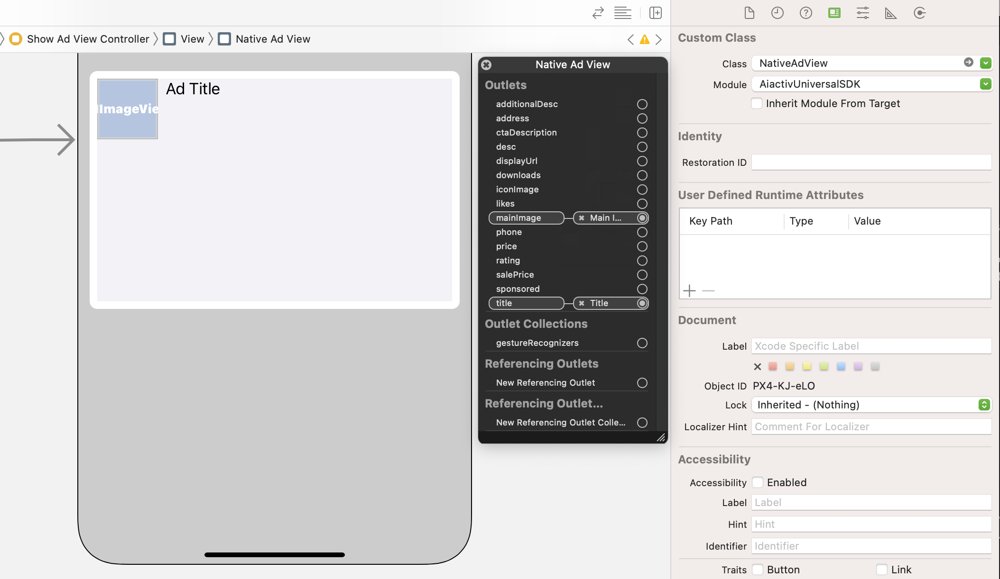
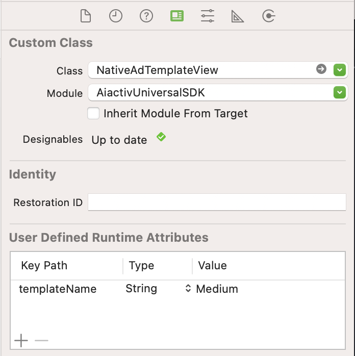

# AiactivUniversalSDK

[](https://cocoapods.org/pods/AiactivUniversalSDK)
[](https://cocoapods.org/pods/AiactivUniversalSDK)
[](https://cocoapods.org/pods/AiactivUniversalSDK)

Ads & Analytics Framework from Ai Activ

## Installation

AiactivUniversalSDK is available through [CocoaPods](https://cocoapods.org). To install
it, simply add the following line to your Podfile:

```ruby
pod 'AiactivUniversalSDK'
```

## Usage

### Init

Add this code to Info.plist and replace your writeKey

```xml
<key>AiactivSDKConfig</key>
<dict>
	<key>writeKey</key>
	<string>YOUR_WRITE_KEY_HERE</string>
</dict>
```

By default, we use same WRITE_KEY for both frameworks. If you would like use WRITE_KEY for AdNetwork, please add new one meta-data for it.

```xml
<key>AiactivSDKConfig</key>
<dict>
	<key>writeKey</key>
	<string>YOUR_WRITE_KEY_HERE</string>

    <key>writeKeyForAdNetwork</key>
	<string>YOUR_WRITE_KEY_HERE</string>
</dict>
```

Import the AiactivUniversalSDK module in your UIApplicationDelegate

```swift
import AiactivUniversalSDK
```

Configure a AiactivUniversalSDK shared instance in your app delegate's application(_:didFinishLaunchingWithOptions:) method

```swift
func application(_ application: UIApplication, didFinishLaunchingWithOptions launchOptions: [UIApplication.LaunchOptionsKey: Any]?) -> Bool {
    // Override point for customization after application launch.

    Aiactiv.start()


    return true
}
```

### Analytics

Analytics will be initialized and collect data and support manually collect event

#### Track Events

```swift
Aiactiv.track(name: "Event name", properties: [String : Any]?)
```

You can custom properties anything you want

```swift
struct UserLoggedInEventProperties: Codable {
    var username: String
    var mail: String
}

let userLoggedInEventProperties = UserLoggedInEventProperties(
    username: "tester",
    mail: "tester@mail.com"
)

Aiactiv.track(name: "User LoggedIn", properties: userLoggedInEventProperties)

```

#### Identify Events

```swift
Aiactiv.identify(userId: "UserID")
```

In case of you need to append more information

```swift
struct UserTraits: Codable {
    var name: String
    var birthday: String
    var phoneNumber: String
}

let traits = UserTraits(
    name: "Tester",
    birthday: "20/12/2022",
    phoneNumber: "+84909090909"
)

Aiactiv.identify(userId: "UserID", traits: traits)
```

#### Screen Events

```swift
Aiactiv.screen(title: "LoginScreen")
```

Properties are extra pieces of information that describe the screen. They can be anything you want.

```swift
struct ScreenProperties: Codable {
    var name: String
    var loginMethod: String
}

let properties = ScreenProperties(
    name: "Login",
    loginMethod: "Apple ID"
)

Aiactiv.screen(title: "LoginScreen", properties: properties)
```

### AdNetwork

#### Banner Ad

```swift
// Create AdView with size and type is banner
let adView = AdView()
adView.adSize = .rectangle
adView.adType = .banner
adView.unitID = NSNumber(value: <<<Find your inventory ID in container>>>)

// Add AdView to your layout
self.view.addSubview(adView)

// Perform loadAd with a request
adView.loadAd(AdRequest())
```

#### Video Ad - Load Ad VAST Tag Url

```swift
// Create AdView with size and type is video
let videoAdLoader = VideoAdLoader(adUnitID: <<<Find your inventory ID in container>>>, adSize: .video)

// Set delegate to retrieve data later
videoAdLoader.delegate = self

// Perform loadAd with a request
videoAdLoader.loadAd(AdRequest())

```

#### Video Ad - Using Native Player to play content and Ad

Define your player in layout and connect IBOutlet in your ViewController
```swift
@IBOutlet weak var imaPlayer: IMAPlayerView!
```

Init player
```swift
override func viewDidLoad() {
    super.viewDidLoad()
    imaPlayer.setup(contentUrl: ContentURLString)
    imaPlayer.delegate = self
}
```

Request Ads
```swift
override func viewDidAppear(_ animated: Bool) {
    super.viewDidAppear(animated)
    imaPlayer.requestAds(adUnitID: <<<Find your inventory ID in container>>>)
}
```

Listen event video Ad loaded and perform playing

```swift
extension ViewController: IMAPlayerViewDelegate {
	func imaPlayerView(_ unitID: Int64, didFailLoad error: AdsNetworkSDKError) {
		imaPlayer.contentPlayer.play()
	}

    func imaPlayerView(_ adsManager: ACIMAAdsManager, didReceive event: ACIMAAdEvent) {
        if event.type == ACIMAAdEventType.LOADED {
            adsManager.start()
        }
    }

    func imaPlayerView(_ adsManager: ACIMAAdsManager, didReceive error: ACIMAAdError) {
        imaPlayer.contentPlayer.play()
    }

    func imaPlayerViewDidRequestContentPause(_ adsManager: ACIMAAdsManager) {
        imaPlayer.contentPlayer.pause()
    }

    func imaPlayerViewDidRequestContentResume(_ adsManager: ACIMAAdsManager) {
        imaPlayer.contentPlayer.play()
    }

    func imaPlayerView(_ loader: ACIMAAdsLoader, adsLoadedWith adsLoadedData: ACIMAAdsLoadedData) {

    }

    func imaPlayerView(_ loader: ACIMAAdsLoader, failedWith adErrorData: ACIMAAdLoadingErrorData) {
        imaPlayer.contentPlayer.play()
    }
}
```

#### Native Ad

##### Display NativeAdView

The first step is to lay out the UIViews that will display native ad assets. You can do this in the Interface Builder as you would when creating any other xib file.

Once the views are in place and you've assigned the correct ad view class to the layout, link the ad view's asset outlets to the UIViews you've created. Here's how you might link the ad view's asset outlets to the UIViews created for an ad:



Once the layout is complete and the outlets are linked, the last step is to add code to your app that performs load an ad via `contentView`.

```swift
@IBOutlet weak var adView: NativeAdView!

...

adView.loadAd(adUnitID: <<<Find your inventory ID in container>>>, adRequest: AdRequest())
```

When NativeAdView loaded, the `mediaContent` will be returned in `NativeAdViewDelegate` contains media metadata (width, height...) to help you better in update layout dimension.

```swift
nativeAdView.delegate = self

...

extension YourViewController: NativeAdViewDelegate {
    func onNativeAdViewEvent(_ view: NativeAdView, adEvent event: NativeAdView.NativeAdEvent) {
        var iconHeight: CGFloat = 0
        if (event.data.name == "AD_LOADED"), let mediaContent = event.mediaContent {
            if let icon = mediaContent.icon {
                iconHeight = icon.height
                NSLayoutConstraint.activate([
                    view.iconImage.widthAnchor.constraint(equalToConstant: icon.width),
                    view.iconImage.heightAnchor.constraint(equalToConstant: icon.height)
                ])
            }

            if let main = mediaContent.main {
                let fixedWidth = view.bounds.width
                let fixedHeight = (fixedWidth * main.height) / main.width
                NSLayoutConstraint.activate([
                    view.mainImage.heightAnchor.constraint(equalToConstant: fixedHeight),
                    view.heightAnchor.constraint(equalToConstant: fixedHeight + iconHeight + 16)
                ])
            }
        }
    }
}
```

##### Display NativeAdTemplateView

The Framework provides three types of template: Default, Medium & Article

Create UIView in your Interface Builder then set class to `NativeAdTemplateView`, pick a template via `templateName` property



Connect to your template IBOutlet and perform load an Ad via `contentView`

```swift
@IBOutlet weak var templateMedium: NativeAdTemplateView!

...

if let contentView = templateMedium.contentView {
    contentView.loadAd(adUnitID: <<<Find your inventory ID in container>>>, adRequest: AdRequest())
}

```


#### Using AdRequest

```swift
// Create AdView
...

// Perform loadAd with a request
let context: [String: String] = [
    "title": "Got Talents show",
    "keywords": "talents, show, tv-show",
    "screen": "HomeScreen"
]
let adRequest = AdRequest(context: context)
adView.loadAd(adRequest)
```


#### Listen Ad Events

##### For Banner Ad - AdViewDelegate
```swift
extension ShowAdViewController: AdViewDelegate {
    func adView(_ adView: AdView, didFailLoad error: AdsNetworkSDKError) {
        print("Ad did fail to load with error: \(error.errorDescription ?? "Unknown")")
    }

    func adView(_ adView: AdView) {
        print("Ad Loaded")
    }

	// Override click on Ad behavior
	func adView(_ adView: AdView, didClickAd url: URL) {
        let safariViewController = SFSafariViewController(url: url)
        present(safariViewController, animated: true)
    }
}
```

##### For Video Ad - VideoAdLoaderDelegate
```swift
extension ShowAdViewController: VideoAdLoaderDelegate {
    func videoAdLoader(_ unitID: Int64, vastTagURL url: String) {
        print("Video Ad Content URL: \(url)")
    }

    func videoAdLoader(_ unitID: Int64, didFailLoad error: AdsNetworkSDKError) {
        print("Video Ad did fail to load with error: \(error.errorDescription ?? "Unknown")")
    }
}
```

##### For Native Ad - VideoAdLoaderDelegate
```swift
extension ShowAdViewController: NativeAdViewDelegate {
    func onNativeAdViewEvent(_ view: NativeAdView, adEvent event: NativeAdView.NativeAdEvent) {
        print("Event: \(event.data.name)")
    }
}
```

## Author

Aicactus, Si Huynh, tan-si.huynh@aicactus.io

## License

AiactivUniversalSDK is available under the MIT license. See the LICENSE file for more info.
